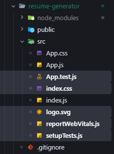
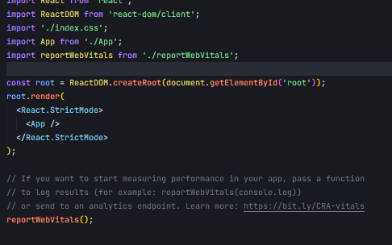
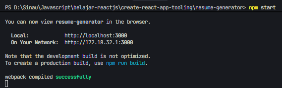
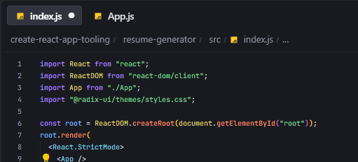
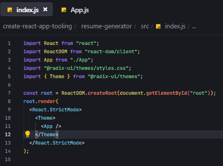
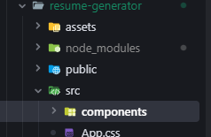
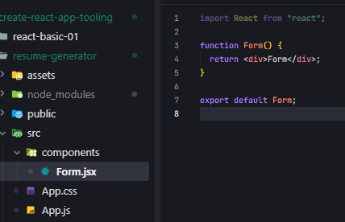
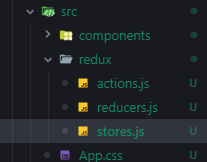

# Belajar React - Project - Resume Builder

Disini akan dijelaskan step by step untuk setup solusi Resume Builder dengan React.

Setup dan Instalasi:

1. Buat project react dengan npx
   
   ```powershell
   npx create-react-app resume-generator
   ```

2. Clean up file yang tidak diperlukan
   
   delete file-file yang tidak diperlukan seperti:
   
   ```js
   App.test.js
   index.css
   logo.svg
   reportWebVitals.js
   setupTest.js
   ```
   
   
   
   buka file` index.js` dan hapus beberapa reference di import ...:
   
   
   
   Hapus file-file:
   
   ```jsx
   import './index.css';
   import reportWebVitals from './reportWebVitals';
   reportWebVitals();
   ```
   
   buka file `App.js` dan hapus:
   
   ```js
   import logo from './logo.svg';
   
   <header className="App-header">
           
           <p>
             Edit <code>src/App.js</code> and save to reload.
           </p>
           <a
             className="App-link"
             href="https://reactjs.org"
             target="_blank"
             rel="noopener noreferrer"
           >
             Learn React
           </a>
         </header>
   ```
   
   Setelah semua sudah dihapus, lakukan start aplikasi untuk melihat apakah masih ada yang error atau tidak.
   
   ```powershell
   npm start
   ```
   
   

3. Install semua file dependensi yang diperlukan
   
   yang perlu diinstall:
   
   ```powershell
   axios
   redux
   react-redux
   redux-thunk
   redux-persist
   ```
   
   ```powershell
   npm i axios redux react-redux redux-thunk redux-persist
   ```

Part selanjutnya adalah membuat aplikasi (Part 1) dengan langkah-langkah sebagai berikut:

1. Install library untuk style
   
   install Radix-UI
   
   ```powershell
   npm i @radix-ui/themes
   ```
   
   Buka file` index.js` untuk add reference radix ui yang sebelumnya telah terinstall (**import css reference**)
   
   ```powershell
   import "@radix-ui/themes/styles.css";
   ```
   
   
   
   Langkah selanjutnya adalah Add Theme Component di index.js
   
   ```powershell
   import { Theme } from "@radix-ui/themes";
   ```
   
    

2. Buat form untuk create resume
   
   Langkah-langkah yang diperlukan:
   
   - buat folder components
     
     
   
   - buat jsx form
     
     
   
   - 

3. Simpan semua input ke redux
   
   Implementasi redux untuk menyimpan semua dari textarea.
   
   - buat folder `redux`
   
   - buat file `redux\actions.js`
   
   - buat file `redux\stores.js`
   
   - buat file `redux\reducers.js`
   
   

4. 
